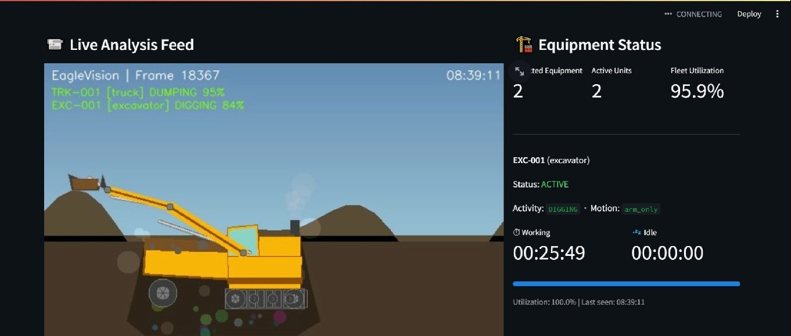
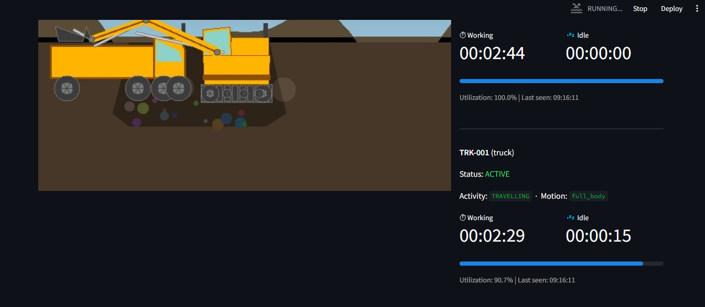

# EagleVision — Construction Equipment Utilization Pipeline

Real-time microservices pipeline for construction site equipment tracking and utilization analysis using computer vision and Apache Kafka.

---

## Architecture Overview

```
┌─────────────┐    ┌──────────────────────┐    ┌─────────────┐    ┌──────────────────┐    ┌──────────────┐
│   Video     │───▶│     cv_service       │───▶│    Kafka    │───▶│analytics_service │───▶│ TimescaleDB  │
│   Input     │    │ YOLOv8 + ByteTrack   │    │  equipment- │    │ (Consumer +      │    │ (Hypertable) │
│ (input.avi) │    │ Zone Optical Flow    │    │   events    │    │   DB Writer)     │    │              │
└─────────────┘    │ Activity Classifier  │    └─────────────┘    └──────────────────┘    └──────────────┘
                   └──────────────────────┘
                              │
                              ▼ JPEG frames
                        ┌──────────┐
                        │  Redis   │
                        │  Pub/Sub │
                        └──────────┘
                              │
                              ▼
                        ┌──────────────┐  queries TimescaleDB
                        │  Dashboard   │◀──────────────────────
                        │  :8501       │
                        └──────────────┘
```

### Services

| Service | Technology | Role |
|---|---|---|
| `cv_service` | YOLOv8, ByteTrack, OpenCV, Kafka Producer | Frame processing, motion analysis, event publishing |
| `analytics_service` | Kafka Consumer, psycopg2 | Event consumption and TimescaleDB persistence |
| `dashboard` | Streamlit, Redis, psycopg2 | Live video feed + utilization metrics UI |
| `kafka` + `zookeeper` | Confluent 7.5 | Event streaming backbone |
| `timescaledb` | TimescaleDB latest-pg15 | Time-series analytics storage |
| `redis` | Redis 7 Alpine | Frame distribution via pub/sub |

---

## Features

- **Real-time Equipment Detection** — YOLOv8 (COCO) with ByteTrack for persistent multi-object tracking
- **Articulated Motion Detection** — Zone-based optical flow separates arm movement from chassis movement, correctly classifying an excavator as ACTIVE even when only the arm is moving
- **Activity Classification** — Rule-based engine classifies: `DIGGING`, `SWINGING`, `DUMPING`, `WAITING`
- **Utilization Metrics** — Per-equipment cumulative Active Time, Idle Time, and Utilization %
- **Live Dashboard** — Streamlit UI with real-time video feed + per-machine status cards
- **Scalable Streaming** — Kafka topic `equipment-events` with 3 partitions; TimescaleDB hypertable for time-series queries

---

## Demo Screenshots

**Figure 1 — Live dashboard: EXC-001 actively digging with `arm_only` motion detection**


**Figure 2 — Equipment cards: per-machine working time, idle time, and utilization %**


> **Note:** Tested on a resource-constrained machine. For optimal video feed performance, 8 GB RAM is recommended.

---

## Quick Start

### Prerequisites

- Docker Desktop (Windows/Mac) or Docker Engine + Compose plugin (Linux)
- At least 4 GB RAM available for Docker
- A video file to process (see below)

### 1. Clone & Configure

```bash
git clone <repository-url>
cd eaglevision
cp .env.example .env
```

### 2. Provide a Video File

Place your video at `cv_service/data/input.avi`. Three options:

**Option A — Real construction footage (recommended)**
```bash
# Download any .avi from Roberts & Golparvar-Fard dataset:
# https://data.mendeley.com/datasets/fyw6ps2d2j/1
# Then place it at: cv_service/data/input.avi
```

**Option B — Use the built-in synthetic scene**
The CV service generates a synthetic construction site scene automatically.
No video file is required — simply run `docker compose up --build`.

**Option C — Download from YouTube**
```bash
pip install yt-dlp
yt-dlp -f mp4 -o cv_service/data/input.avi "<youtube-url>"
```

### 3. Start All Services

```bash
docker compose up --build
```

Startup order is managed by health checks. Full readiness typically takes 60–90 seconds.

### 4. Open the Dashboard

Navigate to **http://localhost:8501** in your browser.

### 5. Monitor Logs

```bash
docker compose logs -f cv_service         # Detection + Kafka events
docker compose logs -f analytics_service  # DB writes
docker compose logs -f dashboard          # Streamlit
```

---

## Configuration

All tuneable parameters live in `.env`:

| Variable | Description | Default |
|---|---|---|
| `VIDEO_SOURCE` | Input video path (inside container) | `data/input.avi` |
| `CONFIDENCE_THRESHOLD` | YOLO detection confidence floor | `0.45` |
| `MOTION_THRESHOLD` | Optical flow magnitude threshold for ACTIVE state | `2.5` |
| `FRAME_SKIP` | Process every Nth frame (1 = every frame) | `2` |
| `TARGET_FPS` | Target output FPS for the video feed | `15` |
| `YOLO_MODEL` | YOLO weights file | `yolov8n.pt` |
| `POSTGRES_DB` | TimescaleDB database name | `eaglevision` |
| `POSTGRES_USER` | TimescaleDB user | `ev_user` |
| `POSTGRES_PASSWORD` | TimescaleDB password | `ev_pass` |
| `REDIS_HOST` | Redis host | `redis` |
| `KAFKA_BOOTSTRAP_SERVERS` | Kafka broker address | `kafka:9092` |
| `KAFKA_TOPIC` | Kafka topic name | `equipment-events` |

---

## Kafka Message Schema

Every Nth frame, the CV service publishes a JSON payload matching the assessment spec exactly:

```json
{
  "frame_id": 450,
  "equipment_id": "EXC-001",
  "equipment_class": "excavator",
  "timestamp": "00:00:15.000",
  "utilization": {
    "current_state": "ACTIVE",
    "current_activity": "DIGGING",
    "motion_source": "arm_only"
  },
  "time_analytics": {
    "total_tracked_seconds": 15.0,
    "total_active_seconds": 12.5,
    "total_idle_seconds": 2.5,
    "utilization_percent": 83.3
  }
}
```

The `motion_source` field distinguishes `arm_only`, `full_body`, `tracks_only`, and `none` — enabling precise articulated-motion classification (see Design Decisions below).

---

## Database Schema

TimescaleDB hypertable `equipment_logs`, partitioned by `time`:

```sql
CREATE TABLE equipment_logs (
    time                  TIMESTAMPTZ      NOT NULL DEFAULT NOW(),
    frame_id              INTEGER          NOT NULL,
    equipment_id          TEXT             NOT NULL,
    equipment_class       TEXT             NOT NULL,
    current_state         TEXT             NOT NULL,    -- ACTIVE | INACTIVE
    current_activity      TEXT             NOT NULL,    -- DIGGING | SWINGING | DUMPING | WAITING
    motion_source         TEXT             NOT NULL,    -- arm_only | full_body | tracks_only | none
    total_tracked_seconds DOUBLE PRECISION,
    total_active_seconds  DOUBLE PRECISION,
    total_idle_seconds    DOUBLE PRECISION,
    util_percent          DOUBLE PRECISION
);
```

---

## Design Decisions & Trade-offs

### Solving Articulated Motion Detection

The core challenge: an excavator arm digging while the tracks remain stationary. A naive whole-bounding-box motion threshold would classify this machine as INACTIVE — which is wrong.

**Our solution — Zone-Based Optical Flow (`motion_analyzer.py`)**

The bounding box of each detected machine is split vertically into two zones:

```
┌─────────────────────┐
│   UPPER ZONE        │  ← Boom, stick, bucket (arm components)
│   (y : y + h/2)    │
├─────────────────────┤
│   LOWER ZONE        │  ← Tracks, chassis
│   (y + h/2 : y2)   │
└─────────────────────┘
```

We compute dense Farneback optical flow independently for each zone and take the mean flow magnitude:

| `upper_mag` | `lower_mag` | `state` | `motion_source` |
|---|---|---|---|
| > threshold | > threshold | ACTIVE | `full_body` |
| > threshold | ≤ threshold | ACTIVE | `arm_only` |
| ≤ threshold | > threshold | ACTIVE | `tracks_only` |
| ≤ threshold | ≤ threshold | INACTIVE | `none` |

This means an excavator actively digging (arm moving, tracks still) is correctly marked **ACTIVE** with `motion_source = "arm_only"` — exactly the articulated-motion case the assessment highlighted.

**Trade-off:** Farneback optical flow is computationally heavier than frame-differencing. We mitigate this by running on every Nth frame (`FRAME_SKIP`) and restricting flow computation to the bounding-box crop rather than the full frame.

---

### Activity Classification (`activity_classifier.py`)

Given that motion is detected in the upper zone, we analyse the **mean flow vector direction** to distinguish activities:

| Condition | Classified as |
|---|---|
| Strong downward flow (`vy > 0`, `\|vy\| > 1.5 × \|vx\|`) | `DIGGING` |
| Strong horizontal flow (`\|vx\| > 1.2 × \|vy\|`) | `SWINGING` |
| Strong upward flow (`vy < 0`, `\|vy\| > 1.5 × \|vx\|`) | `DUMPING` |
| No motion (`motion_source = none`) | `WAITING` |
| All other active motion | `DIGGING` (conservative default) |

A **3-frame debounce** is applied per track ID to avoid flickering between states on noisy frames.

**Trade-off:** Rule-based classification is deterministic and requires no labelled training data, but it is less robust than a learned classifier when camera angles or lighting vary significantly. A fine-tuned sequence model (e.g. LSTM over flow features) would improve accuracy on real footage.

---

### Why Kafka + TimescaleDB + Redis?

- **Kafka** decouples the CV service from downstream consumers. The analytics service can be restarted or scaled independently without losing events (offset-based replay).
- **TimescaleDB** is purpose-built for time-series data with automatic chunk management and fast time-windowed queries — ideal for utilization dashboards.
- **Redis pub/sub** provides sub-100ms frame delivery to the dashboard without going through Kafka, keeping the video feed latency separate from the analytics pipeline.

---

### YOLO Model Choice

We use `yolov8n` (nano) with COCO weights for zero-shot detection. Construction equipment maps to COCO classes: truck (7), bus (5), car (2).

**Limitation:** COCO was not trained on heavy construction equipment, so detection recall is lower than with a domain-specific model. For production, fine-tuning on a construction dataset (e.g. the Mendeley dataset linked above) would significantly improve precision and recall.

---

## Troubleshooting

**Dashboard shows "No data available"**
```bash
docker compose logs cv_service        # Is it processing frames?
docker compose logs analytics_service # Is it consuming and writing to DB?
docker compose restart analytics_service
```

**Video not found / CV service exits immediately**
```bash
ls cv_service/data/input.avi
cd cv_service && python generate_test_video.py
```

**Ports already in use**
```bash
# Ports used: 8501 (dashboard), 9092 (kafka), 5432 (timescaledb), 6379 (redis)
lsof -i :8501
```

**Services fail to start / dependency timeouts**
```bash
docker compose down -v
docker compose up --build
```

---

## Local Development (without Docker)

```bash
python -m venv venv && source venv/bin/activate   # Linux/Mac
# venv\Scripts\activate                           # Windows

pip install -r cv_service/requirements.txt
pip install -r analytics_service/requirements.txt
pip install -r dashboard/requirements.txt

# Requires local Kafka, TimescaleDB, and Redis running.
# Update .env to point to localhost services before running.
python cv_service/main.py
```

---

## Known Limitations

- Standard COCO YOLOv8 uses truck/bus/car classes as proxies — domain-specific fine-tuning is recommended for production
- Heavy occlusion between machines may interrupt ByteTrack ID continuity
- Zone-based optical flow assumes a roughly upright camera angle; very oblique views may skew upper/lower zone classification
- This is a prototype — no authentication, rate limiting, or production hardening applied
